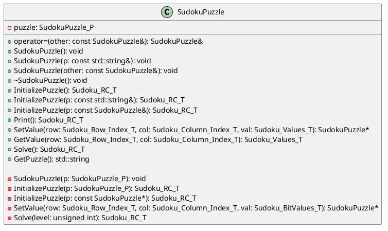

# Sudoku Solver

A C++ library for solving Sudoku puzzles using a pruning and backtracking algorithm.

## Features

- C++ library for solving Sudoku puzzles
- Efficient pruning and backtracking algorithm
- Public API methods for managing and solving Sudoku puzzles
- Get statistics about the solving process (maximum recursion level, number of recursive calls)

## Cloning the Repository

To clone the repository, use the following command:

```bash
git clone https://github.com/FranciscoLlobet/sudoku-solver.git
```

## Example Usage

Following could be the content for your `main.cc`:

```cpp
#include "sudoku.hh"

int main()
{
    std::string puzzle = "003020600900305001001806400008102900700000008006708200002609500800203009005010300";

    SudokuPuzzle sudoku(puzzle);

    if (sudoku.Solve() == SUDOKU_RC_SUCCESS)
    {
        sudoku.Print();
    }
    else
    {
        std::cout << "Failed to solve the Sudoku puzzle." << std::endl;
    }

    return 0;
}
```
This example initializes a `SudokuPuzzle` object with a given puzzle string, solves the puzzle, and prints the solved puzzle to the console.

## How to Compile

Compile the library using `clang`:

```sh
clang++ -std=c++11 -o sudoku_solver main.cc sudoku.cc -I/path/to/headers
```

This command will compile the `main.cc` and `sudoku.cc` files, including the headers from the specified path, using the C++11 standard, and output the executable named `sudoku_solver`.

## Public API Method Reference


Here is an overview of the public methods provided by the `SudokuPuzzle` class:

- `SudokuPuzzle()`: Default constructor that creates a blank Sudoku puzzle.
- `SudokuPuzzle(const std::string &p)`: Constructor that initializes a Sudoku puzzle with a given string.
- `SudokuPuzzle(SudokuPuzzle_P p)`: Constructor that initializes a Sudoku puzzle with a given pointer to a puzzle.
- `SudokuPuzzle(const SudokuPuzzle &p)`: Copy constructor.
- `operator=(const SudokuPuzzle &p)`: Assignment operator.
- `InitializePuzzle()`: Initialize a blank Sudoku puzzle.
- `InitializePuzzle(const std::string &p)`: Initialize a Sudoku puzzle with a given string.
- `InitializePuzzle(SudokuPuzzle_P p)`: Initialize a Sudoku puzzle with a given pointer to a puzzle.
- `InitializePuzzle(const SudokuPuzzle *p)`: Initialize a Sudoku puzzle with a given pointer to a `SudokuPuzzle` object.
- `InitializePuzzle(const SudokuPuzzle &p)`: Initialize a Sudoku puzzle with a given reference to a `SudokuPuzzle` object.
- `Print()`: Print the Sudoku puzzle.
- `SetValue(Sudoku_Row_Index_T row, Sudoku_Column_Index_T col, Sudoku_Values_T val)`: Set the value of a cell in the puzzle.
- `SetValue(Sudoku_Row_Index_T row, Sudoku_Column_Index_T col, Sudoku_BitValues_T val)`: Set the value of a cell in the puzzle using a bitmask.
- `GetValue(Sudoku_Row_Index_T row, Sudoku_Column_Index_T col)`: Get the value of a cell in the puzzle.
- `Solve()`: Solve the Sudoku puzzle.

## License

This project is licensed as indicated in the [LICENSE](LICENSE) file
